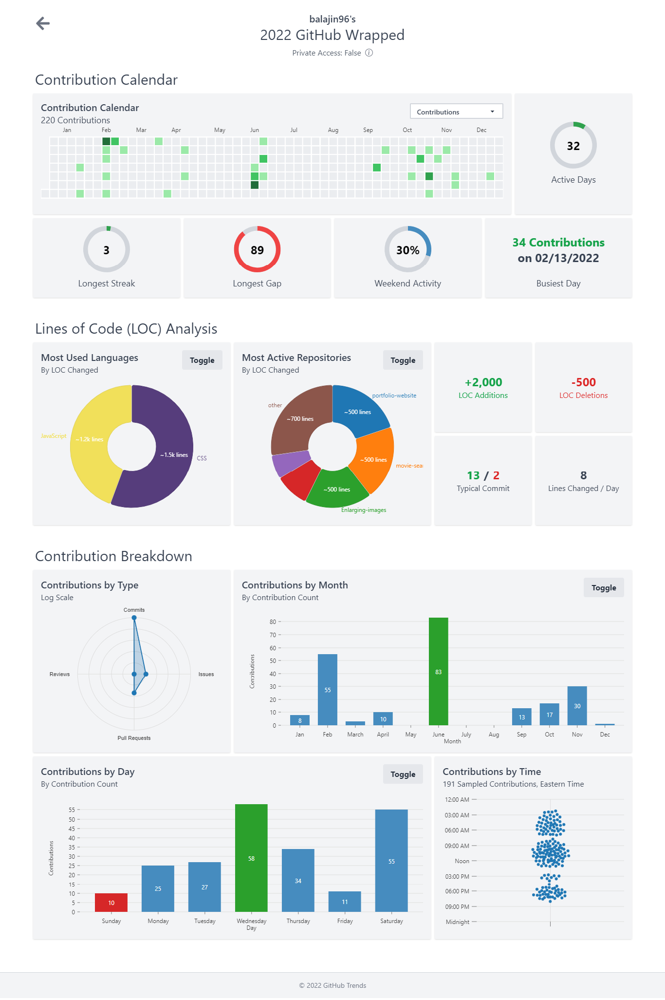

<h2 align="center">Hi / Hola / Bonjiur / வணக்கம்🙏, Welcome to my page!👋, </h2>

I'm <b><i>Balaji,</i></b> Front-End developer with the right mix of Designing Principles & Functional Programming.
 Goal driven person who loves to learn fullstack technology and passionate about web development.

## 🌏 Connect with me:

<h2>🌠  Languages and Tools: </h2>

 
 

 

 

## 🌌 My Github Stats 2023 and 📈 My Github Streaks 

 &#160; &#160;

 
 

## 💁🏻 Repository Contributions and 🧠 Language Contributions

 &#160; &#160; 

 
 

<h2>🚀 My Github stats 2022 <a href="https://www.githubtrends.io/wrapped/balajin96" target="#" > (link) </a> </h2>

 

